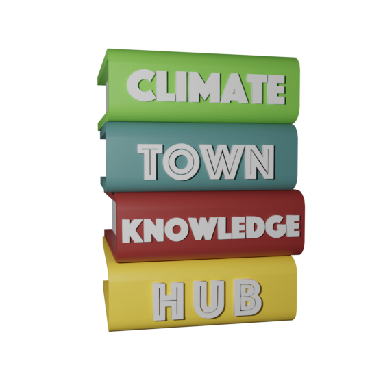

---

The "behind the scenes" of the [ClimateTown Knowledge Hub](https://climatetown.github.io/knowledge-hub), your "one stop shop" for important climate resources in the fight against climate change!

## How to suggest a resource

- [Create an issue](https://github.com/ClimateTown/knowledge-hub/issues/new/choose) selecting "suggest a resource".
- Fill out the form adhering to the instructions.
- Get the resource approved (or discuss it futher in the issue).
- Once approved, resource is then onboarded onto the website. Resource onboarding happens every Friday!!

## Contributing

> TLDR; [Create an issue](https://github.com/ClimateTown/knowledge-hub/issues/new/choose), or edit the content directly and make a pull request.

All contributions welcome! Everything from:

- suggestions
- fixing typos
- writing content
- helping with website development
- discussing content on the hub (check out the channels on Discord for this!)

The following sections go through how you can make different contributions. These will require you having a GitHub account.

For any discussion or questions about the Knowledge Hub, join us in `#💬knowledge-hub-discussion` in the ClimateTown Discord.

### Small edits/typos

Resources data (title, URL, description, tags) are stored in the `data/resources.yml` file, which is then used to populate the resource on the website. To make small edits, you can [directly edit this file](https://github.com/ClimateTown/knowledge-hub/edit/main/data/resources.yml) or you can create an issue.

To suggest changes anywhere else in the site, you can use GitHub's search functionality to find the exact file which to suggest the change.

### Resource suggestions

We're always looking to publicise awesome climate resources. Got a resource to share? The easiest way is to create an issue, filling out the "resource suggestion" form. This will create a discussion around the resource, and if it's a good fit for the Knowledge Hub, we'll add it to the site.

### Site suggestions

This website is powered by coders from the community. Have a suggestion to make the site better? Create an issue and we'll discuss it! If the feature sounds good, we'll look at adding it to the site. The feature is much more likely to be added if you are willing to help with the development.

## Development installation

The site is built using [Svelte](https://svelte.dev/) and [SvelteKit](https://kit.svelte.dev/). A dev environment can be easily set up using Node and npm:

- [install Node and npm](https://docs.npmjs.com/downloading-and-installing-node-js-and-npm/)
- `git clone https://github.com/ClimateTown/knowledge-hub.git`
- `cd` into the cloned directory
- `npm install`
- `npm run dev`

### OPTIONAL: Python

Some of the tools in the codebase (eg. YouTube API, JSON schema validation) use Python. For most changes to the site Python is not required.

To set up Python:

- install Python from [here](https://www.python.org/downloads/) if you haven't already (minimum version 3.7)
- create a virtual environment, then activate it (optional, but recommended)
  - `python -m venv venv`
  - activate the environment using either:
    - `source venv/bin/activate` (Linux/MacOS)
    - `venv\Scripts\activate.bat` (Windows)
- `pip install -r requirements.txt`

This codebase uses [`pip-tools`](https://pypi.org/project/pip-tools/) to manage dependencies. If you add a new dependency, you can add it to `requirements.in` and run `pip-compile` to update `requirements.txt`. To update your environment run `pip-sync`.

### OPTIONAL: Loading YouTube Data
To set up the YouTube API (important for working on scripts with YouTube video scraping):

- Follow the python installation steps above
- Go to <https://console.cloud.google.com> and create account
- Go to <https://console.cloud.google.com/apis/credential>
- Make an API Key: Create Credentials > API Key
- Enable Youtube API v3 <https://console.cloud.google.com/marketplace/product/google/youtube.googleapis.com>
- Make a .env file in root folder (where this file is)
- Add YOUTUBE_API_KEY=YourApiKeyHere
- Run python scripts/youtube.py

### OPTIONAL: Pre-commit

This codebase uses [pre-commit](https://pre-commit.com/) and [pre-commit CI](https://pre-commit.ci/) to run linting on code, format Python code, and generally have help with code quality.

You can either set up pre-commit locally (completely optional; it will run on every commit, aborting a commit if the pre-commit workflow fails), or you do nothing and leave it up to pre-commit CI to take care of it (where it will run on every push to GitHub, and fixes changes in PRs).

To set up pre-commit locally:

- install the Python environment (which includes pre-commit)
- `pre-commit install` to install the hooks

To run pre-commit manually (without making a commit), use `pre-commit run --all-files`. If you want to stop using pre-commit locally, just do `pre-commit uninstall`.

## ✨Contributors

Thanks go to these wonderful people ([emoji key](https://allcontributors.org/docs/en/emoji-key)):

<!-- ALL-CONTRIBUTORS-LIST:START - Do not remove or modify this section -->
<!-- prettier-ignore-start -->
<!-- markdownlint-disable -->
<table>
  <tbody>
    <tr>
      <td align="center" valign="top" width="14.28%"><a href="https://github.com/VeckoTheGecko"> <b>Vecko</b></a> <a href="https://github.com/ClimateTown/knowledge-hub/commits?author=VeckoTheGecko" title="Code">💻</a> <a href="#content-VeckoTheGecko" title="Content">🖋</a> <a href="#ideas-VeckoTheGecko" title="Ideas, Planning, & Feedback">🤔</a> <a href="#maintenance-VeckoTheGecko" title="Maintenance">🚧</a> <a href="#projectManagement-VeckoTheGecko" title="Project Management">📆</a></td>
      <td align="center" valign="top" width="14.28%"><a href="https://github.com/azebramoomoo"> <b>azebramoomoo</b></a> <a href="#content-azebramoomoo" title="Content">🖋</a> <a href="#design-azebramoomoo" title="Design">🎨</a></td>
      <td align="center" valign="top" width="14.28%"><a href="https://github.com/Jacobjeevan"> <b>Jacob John Jeevan</b></a> <a href="https://github.com/ClimateTown/knowledge-hub/commits?author=Jacobjeevan" title="Code">💻</a></td>
      <td align="center" valign="top" width="14.28%"><a href="https://github.com/Morzaram"> <b>Chris King</b></a> <a href="https://github.com/ClimateTown/knowledge-hub/commits?author=Morzaram" title="Code">💻</a></td>
      <td align="center" valign="top" width="14.28%"><a href="https://github.com/JarrodBaniqued"> <b>JarrodBaniqued</b></a> <a href="#content-JarrodBaniqued" title="Content">🖋</a></td>
      <td align="center" valign="top" width="14.28%"><a href="https://daniellemlbastien.com/"> <b>Danielle Bastien</b></a> <a href="#a11y-dmlb" title="Accessibility">️️️️♿️</a></td>
      <td align="center" valign="top" width="14.28%"><a href="https://github.com/tutterown"> <b>Nick Tutterow</b></a> <a href="https://github.com/ClimateTown/knowledge-hub/commits?author=tutterown" title="Code">💻</a> <a href="#content-tutterown" title="Content">🖋</a></td>
    </tr>
    <tr>
      <td align="center" valign="top" width="14.28%"><a href="https://github.com/GBT7"> <b>GBT7</b></a> <a href="#content-GBT7" title="Content">🖋</a></td>
      <td align="center" valign="top" width="14.28%"><a href="https://github.com/williamtaggart97"> <b>Billy Taggart</b></a> <a href="#ideas-williamtaggart97" title="Ideas, Planning, & Feedback">🤔</a></td>
      <td align="center" valign="top" width="14.28%"><a href="https://github.com/Micahg05"> <b>Micahg05</b></a> <a href="https://github.com/ClimateTown/knowledge-hub/commits?author=Micahg05" title="Code">💻</a></td>
      <td align="center" valign="top" width="14.28%"><a href="https://github.com/ForrestCinelli"> <b>Forrest Cinelli</b></a> <a href="#content-ForrestCinelli" title="Content">🖋</a></td>
      <td align="center" valign="top" width="14.28%"><a href="https://github.com/werner33"> <b>Jordan Manley</b></a> <a href="https://github.com/ClimateTown/knowledge-hub/commits?author=werner33" title="Code">💻</a></td>
    </tr>
  </tbody>
</table>

<!-- markdownlint-restore -->
<!-- prettier-ignore-end -->

<!-- ALL-CONTRIBUTORS-LIST:END -->

This project follows the [all-contributors](https://allcontributors.org) specification. Contributions of any kind are welcome!

## Acknowledgements

- [Twemoji](https://twemoji.twitter.com/) for emoji support
