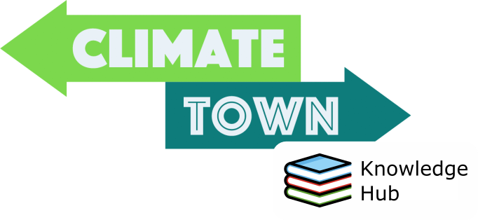

---

### Update: A maintainer has gone on break. Will be back July 2024 🤠

The "behind the scenes" of the [ClimateTown Knowledge Hub](https://hub.climatetownproductions.com), your "one-stop shop" for important online resources in the fight against climate change!

## How to suggest a resource

- [Create an issue](https://github.com/ClimateTown/knowledge-hub/issues/new/choose) and select "✨Resource Suggestion".
- Fill out the form. Please adhere to the instructions.
- Get the resource approved (or discuss it further in the issue).
- Once approved, resource is then onboarded onto the website. Resource onboarding happens at least once a month (on the first Sunday)!

## Contributing

> TLDR: [Create an issue](https://github.com/ClimateTown/knowledge-hub/issues/new/choose), or edit the content directly and make a pull request.

All contributions welcome! We embrace:

- suggestions
- fixing typos
- writing content
- helping with website development, and
- discussing content on the Hub (check out the channels on Discord for this!)

The following sections go through how you can make different contributions. These will require you having a GitHub account.

For any discussion or questions about the Knowledge Hub, join us in the `#💬knowledge-hub-discussion` channel in the Climate Town Discord.

### Small edits/typos

Resources data (titles, URLs, descriptions, and tags) are stored in the `data/resources.yml` file, which is then used to populate the resource on the website. To make small edits, you can [directly edit this file](https://github.com/ClimateTown/knowledge-hub/edit/main/data/resources.yml) or you can create an issue.

To suggest changes anywhere else in the site, you can use GitHub's search functionality to find the exact file in which to suggest them.

### Resource suggestions

We're always looking to publicise awesome climate resources. Got a resource to share? The easiest way is to create an issue, filling out the "resource suggestion" form. This will create a discussion around the resource, and if it's a good fit for the Knowledge Hub, we'll add it to the site.

### Site improvements

This website is powered by coders from the community. If you want to contribute to the website, please follow the following guidelines:

- Create suggestions as issues in the repository. Discuss suggestions before submitting a pull request (unless the improvement is objectively good; e.g. performance, accessibility).
- If you want to work on an issue, drop a comment on it (this helps prevent unnecessary doubling up of work). If someone working on an issue hasn't updated the issue in a few weeks, feel free to drop a comment of your own if you want to try it out.

## Development setup

The site is primarily built using [Svelte](https://svelte.dev/) and [SvelteKit](https://kit.svelte.dev/), using Python for some additional tools in the codebase (eg. YouTube API, JSON schema validation). The following sections go through two options for installation, how to add Python dependencies, and setting up the YouTube API key.

### ⚡QUICK SETUP⚡

TLDR; simply click this badge to spin up a Codespaces cloud environment 🕺

For local development, this repo provides a [dev container](https://code.visualstudio.com/docs/devcontainers/containers) to streamline installation (assuming you're familiar with Docker and have it installed). Building and running this container will install all dependencies for the project, and run the development server in the background piping the output to `nohup.out`.

### Manual installation

Alternatively, you can install all project dependencies manually in the OS of your choice.

#### Node and npm (for Svelte and SvelteKit)

- [install Node and npm](https://docs.npmjs.com/downloading-and-installing-node-js-and-npm/)
- `git clone https://github.com/ClimateTown/knowledge-hub.git`
- `cd` into the cloned directory
- `npm install`
- `npm run dev`

#### OPTIONAL: Python

As mentioned above, Python is only responsible for some tooling in the codebase. For most changes to the site, Python is not required.

- [install Python](https://www.python.org/downloads/) if you haven't already (minimum version 3.7)
- create a virtual environment, then activate it (optional, but recommended)
  - `python -m venv venv`
  - activate the environment using either:
    - `source venv/bin/activate` (Linux/MacOS)
    - `venv\Scripts\activate.bat` (Windows)
- `pip install -r requirements.txt`

#### OPTIONAL: Pre-commit

This codebase uses [pre-commit](https://pre-commit.com/) and [pre-commit CI](https://pre-commit.ci/) to run linting on code, format Python code, and generally have help with code quality.

To set up pre-commit locally:

- install the Python environment (which includes pre-commit)
- `pre-commit install` to install the hooks

To run pre-commit manually (without making a commit), use `pre-commit run --all-files`. If you want to stop using pre-commit locally, just do `pre-commit uninstall`.

---

### Adding Python dependencies

This codebase uses [`pip-tools`](https://pypi.org/project/pip-tools/) to manage dependencies. If you add a new dependency, you can add it to `requirements.in` and run `pip-compile` to update `requirements.txt`. To update your environment run `pip-sync`.

### YouTube API Keys

To set up the YouTube API (important for working on scripts with YouTube video scraping):

- Follow the python installation steps above
- Go to <https://console.cloud.google.com> and create account
- Go to <https://console.cloud.google.com/apis/credential>
- Make an API Key: Create Credentials > API Key
- Enable Youtube API v3 <https://console.cloud.google.com/marketplace/product/google/youtube.googleapis.com>
- Make a .env file in root folder (where this file is)
- Add YOUTUBE_API_KEY=YourApiKeyHere
- Run `python scripts/youtube.py`

## ✨Contributors

Thanks go to these wonderful people ([emoji key](https://allcontributors.org/docs/en/emoji-key)):

<!-- ALL-CONTRIBUTORS-LIST:START - Do not remove or modify this section -->
<!-- prettier-ignore-start -->
<!-- markdownlint-disable -->
<table>
  <tbody>
    <tr>
      <td align="center" valign="top" width="14.28%"><a href="https://github.com/VeckoTheGecko"> <b>Vecko</b></a> <a href="https://github.com/ClimateTown/knowledge-hub/commits?author=VeckoTheGecko" title="Code">💻</a> <a href="#content-VeckoTheGecko" title="Content">🖋</a> <a href="#ideas-VeckoTheGecko" title="Ideas, Planning, & Feedback">🤔</a> <a href="#maintenance-VeckoTheGecko" title="Maintenance">🚧</a> <a href="#projectManagement-VeckoTheGecko" title="Project Management">📆</a></td>
      <td align="center" valign="top" width="14.28%"><a href="https://daniellemlbastien.com/"> <b>Danielle Bastien</b></a> <a href="#a11y-dmlb" title="Accessibility">️️️️♿️</a> <a href="https://github.com/ClimateTown/knowledge-hub/commits?author=dmlb" title="Code">💻</a> <a href="#maintenance-dmlb" title="Maintenance">🚧</a> <a href="https://github.com/ClimateTown/knowledge-hub/pulls?q=is%3Apr+reviewed-by%3Admlb" title="Reviewed Pull Requests">👀</a></td>
      <td align="center" valign="top" width="14.28%"><a href="https://github.com/azebramoomoo"> <b>azebramoomoo</b></a> <a href="#content-azebramoomoo" title="Content">🖋</a> <a href="#design-azebramoomoo" title="Design">🎨</a></td>
      <td align="center" valign="top" width="14.28%"><a href="https://github.com/Jacobjeevan"> <b>Jacob John Jeevan</b></a> <a href="https://github.com/ClimateTown/knowledge-hub/commits?author=Jacobjeevan" title="Code">💻</a></td>
      <td align="center" valign="top" width="14.28%"><a href="https://github.com/Morzaram"> <b>Chris King</b></a> <a href="https://github.com/ClimateTown/knowledge-hub/commits?author=Morzaram" title="Code">💻</a></td>
      <td align="center" valign="top" width="14.28%"><a href="https://github.com/JarrodBaniqued"> <b>Jarrod Baniqued</b></a> <a href="#content-JarrodBaniqued" title="Content">🖋</a> <a href="https://github.com/ClimateTown/knowledge-hub/issues?q=author%3AJarrodBaniqued" title="Bug reports">🐛</a></td>
      <td align="center" valign="top" width="14.28%"><a href="https://github.com/tutterown"> <b>Nick Tutterow</b></a> <a href="https://github.com/ClimateTown/knowledge-hub/commits?author=tutterown" title="Code">💻</a> <a href="#content-tutterown" title="Content">🖋</a></td>
    </tr>
    <tr>
      <td align="center" valign="top" width="14.28%"><a href="https://github.com/GBT7"> <b>GBT7</b></a> <a href="#content-GBT7" title="Content">🖋</a></td>
      <td align="center" valign="top" width="14.28%"><a href="https://github.com/williamtaggart97"> <b>Billy Taggart</b></a> <a href="#ideas-williamtaggart97" title="Ideas, Planning, & Feedback">🤔</a></td>
      <td align="center" valign="top" width="14.28%"><a href="https://github.com/Micahg05"> <b>Micahg05</b></a> <a href="https://github.com/ClimateTown/knowledge-hub/commits?author=Micahg05" title="Code">💻</a></td>
      <td align="center" valign="top" width="14.28%"><a href="https://github.com/ForrestCinelli"> <b>Forrest Cinelli</b></a> <a href="#content-ForrestCinelli" title="Content">🖋</a></td>
      <td align="center" valign="top" width="14.28%"><a href="https://github.com/werner33"> <b>Jordan Manley</b></a> <a href="https://github.com/ClimateTown/knowledge-hub/commits?author=werner33" title="Code">💻</a></td>
      <td align="center" valign="top" width="14.28%"><a href="https://discord.com/users/165584193093369856"> <b>cpufreak101</b></a> <a href="#design-cpufreak101#9442" title="Design">🎨</a></td>
      <td align="center" valign="top" width="14.28%"><a href="https://github.com/Veeltu"> <b>Paweł Andrys</b></a> <a href="https://github.com/ClimateTown/knowledge-hub/commits?author=Veeltu" title="Code">💻</a></td>
    </tr>
    <tr>
      <td align="center" valign="top" width="14.28%"><a href="http://hackerone.com"> <b>Matthew Caughman</b></a> <a href="https://github.com/ClimateTown/knowledge-hub/pulls?q=is%3Apr+reviewed-by%3Amacaugh" title="Reviewed Pull Requests">👀</a></td>
      <td align="center" valign="top" width="14.28%"><a href="https://github.com/Lasercar"> <b>LaserCar</b></a> <a href="#content-LaserCar" title="Content">🖋</a></td>
      <td align="center" valign="top" width="14.28%"><a href="https://www.linkedin.com/in/isidro-molina-b20497215/"> <b>Isidro Molina</b></a> <a href="https://github.com/ClimateTown/knowledge-hub/commits?author=imolina212" title="Code">💻</a></td>
      <td align="center" valign="top" width="14.28%"><a href="https://www.linkedin.com/in/christina-loiacono/"> <b>Christina Loiacono</b></a> <a href="https://github.com/ClimateTown/knowledge-hub/commits?author=christina-ml" title="Code">💻</a></td>
      <td align="center" valign="top" width="14.28%"><a href="https://github.com/rivermizell"> <b>River Mizell</b></a> <a href="#content-rivermizell" title="Content">🖋</a></td>
      <td align="center" valign="top" width="14.28%"><a href="https://github.com/monedula"> <b>monedula</b></a> <a href="#content-monedula" title="Content">🖋</a></td>
      <td align="center" valign="top" width="14.28%"><a href="http://commitsovercoffee.com"> <b>Sourav Singh</b></a> <a href="https://github.com/ClimateTown/knowledge-hub/commits?author=commitsovercoffee" title="Code">💻</a></td>
    </tr>
    <tr>
      <td align="center" valign="top" width="14.28%"><a href="https://github.com/Lyrete"> <b>Tommi Alajoki</b></a> <a href="https://github.com/ClimateTown/knowledge-hub/commits?author=Lyrete" title="Code">💻</a></td>
      <td align="center" valign="top" width="14.28%"><a href="https://github.com/Stephen-at-Pleno"> <b>Stephen Tanner</b></a> <a href="#content-Stephen-at-Pleno" title="Content">🖋</a></td>
    </tr>
  </tbody>
</table>

<!-- markdownlint-restore -->
<!-- prettier-ignore-end -->

<!-- ALL-CONTRIBUTORS-LIST:END -->

This project follows the [all-contributors](https://allcontributors.org) specification. Contributions of any kind are, again, welcome!

## Acknowledgements

- [Bootstrap Icons](https://icons.getbootstrap.com/) for icons via [svelte-bootstrap-icons](https://www.npmjs.com/package/svelte-bootstrap-icons)
- [Twemoji](https://twemoji.twitter.com/) for emoji support
